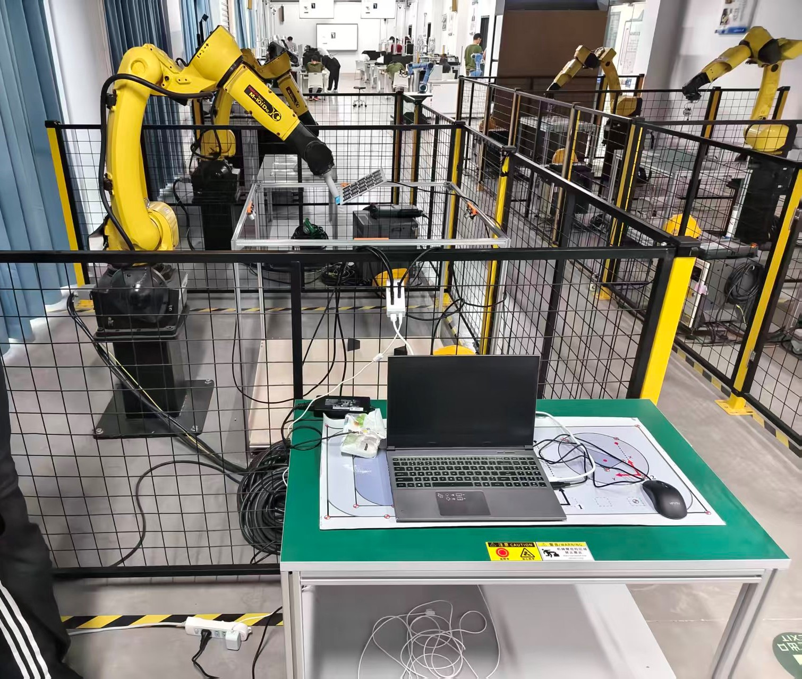
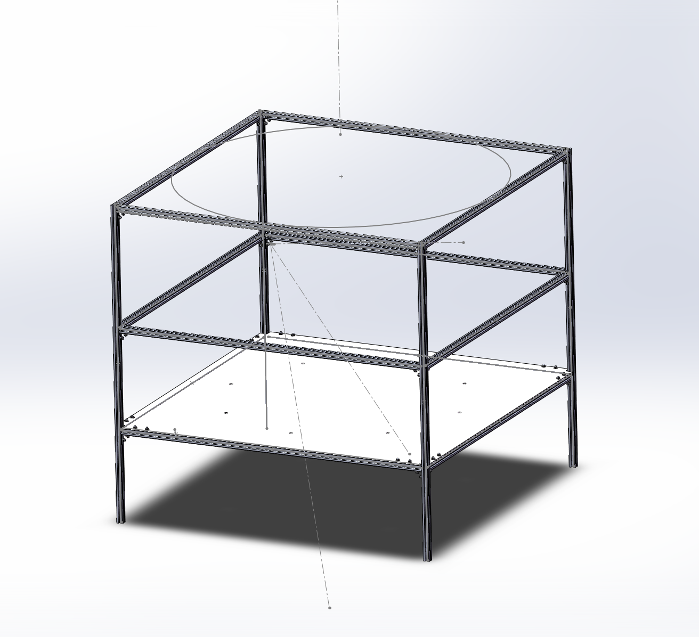
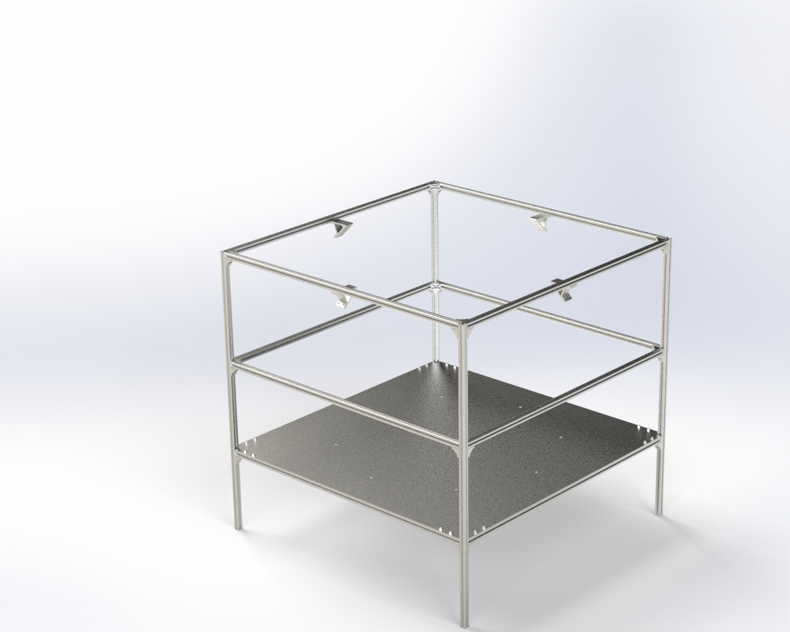
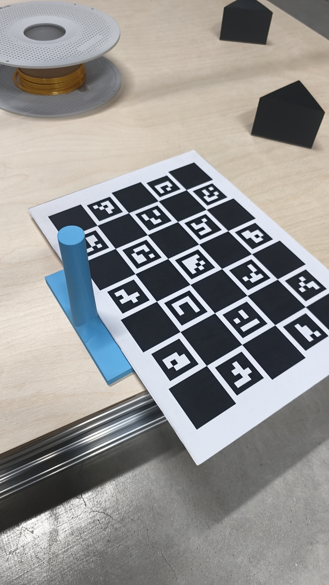

# 多目RealSense三维重建与机器人喷涂轨迹生成系统

**Multi-Camera RealSense 3D Reconstruction & Robot Spray-Painting Trajectory Generation System**

[](https://www.python.org/)
[](LICENSE)
[]()
[]()

> ⚠️ **知识产权声明**
>
> 本仓库发布**核心算法代码与硬件设计**用于技术展示。部分实现细节、生产参数和完整配置
> 因课题组知识产权限制已做抽象处理（用 `YOUR_CAMERA_SERIAL`、`YOUR_ROBOT_IP` 等占位符
> 替代）。**完整可运行代码可根据合作或评估需要提供**。详见 [LICENSE](LICENSE)。

[English README](README.md)

---

## 📸 系统一览

| 四相机采集系统 | FANUC 机器人现场部署 |
|:---:|:---:|
|  |  |

| SolidWorks 装配体 | 相机支架渲染图 |
|:---:|:---:|
|  |  |

| 标定系统 |
|:---:|
|  |

> 📹 [标定过程演示视频](images/calib-process.mp4)

---

## 项目概述

本项目构建了一套完整的 **"视觉感知 → 三维重建 → 轨迹规划 → 机器人执行"** 闭环系统。
使用 4 台 Intel RealSense D435 深度相机搭建多视角采集平台，实现工件的高精度稠密三维重建，
并基于重建结果自动生成 FANUC 工业机器人喷涂轨迹程序（LS 文件），通过 FTP 直接下发至机器
人控制器执行。整套系统已在 **FANUC M-10iD/12 工业机器人喷涂产线** 实际部署验证。

### 核心能力

- **多视角三维重建** — 4 台 D435 同步采集，稠密 ICP + TSDF 体积融合生成水密网格模型
- **自动轨迹规划** — 凸包切片 + B样条平滑，从任意形状工件自动生成均匀覆盖喷涂路径
- **原生机器人代码输出** — 直接生成 FANUC LS 程序，FTP 上传至控制器即刻执行
- **产线级自动化** — UDP 与 PLC 握手，循环工作模式，全程无需人工干预
- **预部署仿真验证** — FANUC Roboguide 喷涂仿真，提前发现碰撞风险
- **完整硬件方案** — 自研四相机标定平台，含 **SolidWorks 源文件**（`.SLDPRT`/`.SLDASM`）、
  3D 打印文件（`.3MF`）、采购清单

---

## 技术管线

```
┌──────────┐    ┌──────────┐    ┌──────────┐    ┌───────────┐
│ 1.标定   │───▶│ 2.融合   │───▶│ 3.后处理 │───▶│ 4.配准    │
│ 多相机   │    │ 点云     │    │ 裁剪分割 │    │ PCD→STL   │
│ ChArUco  │    │ ICP/TSDF │    │ 坐标变换 │    │ FPFH+RANSAC│
└──────────┘    └──────────┘    └──────────┘    └─────┬─────┘
                                                      │
┌──────────┐    ┌──────────┐    ┌──────────┐    ┌────▼─────┐
│ 8.仿真   │◀───│ 7.通讯   │◀───│ 6.规划   │◀───│ 5.网格    │
│ Roboguide│    │ FTP/UDP  │    │ 凸包切片 │    │ Poisson   │
│ 验证     │    │ 手眼标定 │    │ B样条    │    │ 曲面重建  │
└──────────┘    └──────────┘    └──────────┘    └──────────┘
```

### 各阶段说明

| # | 阶段 | 关键技术 | 输出 |
|---|------|---------|------|
| 1 | **多相机标定** | ChArUco 检测、solvePnP 位姿估计、MAD 离群剔除 | 各相机→参考相机 4×4 变换 |
| 2 | **点云融合** | 稠密 ICP、TSDF 体积融合、时空滤波（4 种模式） | 融合点云（~80 万点/帧） |
| 3 | **后处理** | 包围盒裁剪、RANSAC 平面分割、欧式聚类去噪 | 干净工件点云 |
| 4 | **配准** | FPFH 特征 + RANSAC 全局粗配准 + Point-to-Plane ICP | PCD→STL 变换矩阵 |
| 5 | **网格重建** | Poisson 曲面重建 + 非流形边修复 + 顶点聚类简化 | 水密三角网格 |
| 6 | **轨迹规划** | 凸包切片 + OBB + B样条平滑 + 最近表面姿态 | 6-DOF 喷枪轨迹 |
| 7 | **机器人通讯** | Eye-to-hand 标定、FTP 上传、UDP/PLC 握手 | 机器人可执行 LS 程序 |
| 8 | **仿真验证** | FANUC Roboguide 喷涂仿真 | 验证后的安全轨迹 |

---

## 技术栈

| 层级 | 技术 |
|------|------|
| **编程语言** | Python 3.8+ |
| **深度传感** | Intel RealSense SDK 2.0 (pyrealsense2) |
| **计算机视觉** | OpenCV (ChArUco 标记检测、solvePnP、相机标定) |
| **三维处理** | Open3D (ICP、TSDF、FPFH、RANSAC、Poisson 重建) |
| **数值计算** | NumPy、SciPy (线性代数、B样条插值、空间变换) |
| **机器人编程** | FANUC TP/LS 语言 |
| **通讯协议** | FTP (ftplib)、UDP (socket)、PLC 握手协议 |
| **仿真平台** | FANUC Roboguide (喷涂插件) |
| **机械设计** | SolidWorks（零件/装配体）、3D 打印（PLA/ABS） |

---

## 核心亮点

- 🔧 **自研四相机平台** — 完整 SolidWorks 设计文件 + 3D 打印件 + BOM 采购清单，铝型材框架，
  可调角度相机支架，保证产线级重复定位精度

- 🎯 **双路点云策略** — **稠密点云**（stride=2）保留细节用于最终融合，**稀疏 ICP 点云**
  （stride=8 + 体素降采样）用于快速配准。ICP 只修正位姿，不损失点云密度

- 🔄 **多路径融合方案** — 基础 ICP / 稠密 Point-to-Plane ICP / TSDF 体积融合 / 时序滤波融合，
  按场景切换速度-精度平衡

- 📐 **凸包切片轨迹规划** — 计算工件点云凸包 → 提取有向包围盒 OBB → 沿长轴等距切片（20mm）
  → 法向偏移（80mm standoff）→ B样条平滑（C²连续）→ 弧长重采样。对任意复杂外形工件鲁棒

- 🎨 **最近表面姿态定向** — 喷枪 Z 轴始终指向工件表面最近点，确保喷涂均匀。最大转角步长约束
  （8°/步）防止机器人腕部奇异

- 🏭 **产线级自动化** — UDP 接收 PLC 启动信号 → 自动采集处理 → 生成 LS → FTP 上传 → 回复
  完成状态 → 自动清理中间文件，循环运行

---

## 💻 核心代码展示

### 特性一：双路点云 ICP 融合策略

来自 [`fusion/multi_d435_fusion_dense_icp.py`](fusion/multi_d435_fusion_dense_icp.py)：

```python
# 点云分为两套独立管线：
#   - dense_pcds: stride=2, 高细节 → 最终融合、显示、保存
#   - icp_pcds:   stride=8 + 体素降采样 → 仅用于 ICP 匹配
#
# ICP 在稀疏点云上估计位姿修正 T_icp_refine，
# 然后将 T_total = T_icp_refine @ T_init 应用于稠密点云。
# 效果：快速 ICP 收敛 + 高保真输出

for cam_idx in range(1, len(cam_serials)):
    # 1. 分别构建稀疏 ICP 点云和稠密点云
    icp_pcd = preprocess_pcd_for_icp(depth_frame, stride=8, voxel=0.01)
    dense_pcd = preprocess_dense_single_pcd(depth_frame, stride=2)

    # 2. 稀疏点云做 ICP — 快速稳定
    T_icp_refine = run_icp(icp_pcd, ref_icp_pcd, init_transform=T_init)

    # 3. 总修正应用于稠密点云
    T_total = T_icp_refine @ T_init
    dense_pcd.transform(T_total)
```

### 特性二：MAD 鲁棒外参筛选

来自 [`calib/multi_select_best_extrinsics_yaml.py`](calib/multi_select_best_extrinsics_yaml.py)：

```python
# 收集每台相机 N 次标定样本 → 筛选最优外参

# 第一步：统计中心估计
trans_median = np.median(all_translations, axis=0)      # 逐元素平移中位数
quat_avg = quaternion_average(all_quaternions)           # 四元数外积矩阵特征分解

# 第二步：MAD 离群剔除（中位数绝对偏差）
trans_dist = np.linalg.norm(trans - trans_median, axis=1)
rot_dist = rotation_geodesic_angle_deg(rot, rot_center)
mad_trans = np.median(np.abs(trans_dist - np.median(trans_dist)))
mad_rot = np.median(np.abs(rot_dist - np.median(rot_dist)))
is_outlier = (trans_dist / mad_trans > K) | (rot_dist / mad_rot > K)

# 第三步：非离群样本综合评分选最优
score = W_TRANS * trans_dist + W_ROT * (rot_dist / 180.0)
best_idx = np.argmin(score[~is_outlier])
```

### 特性三：FANUC LS 程序 FTP 上传

来自 [`robot_comm/ftp_upload_test.py`](robot_comm/ftp_upload_test.py)：

```python
def upload_ls_to_fanuc(local_ls_path, host, user, password, remote_dir="md:/"):
    """将 .ls 轨迹文件通过 FTP 上传至 FANUC 机器人控制器"""

    # 建立连接（FANUC 默认 Active 模式）
    ftp = FTP()
    ftp.connect(host=host, port=21, timeout=15.0)
    ftp.login(user=user, passwd=password)
    ftp.cwd(remote_dir)

    # ASCII 模式上传（FANUC .ls 为文本文件）
    ftp.voidcmd("TYPE A")

    # 换行符标准化后上传
    with open(local_ls_path, "rb") as f:
        raw = f.read()
    raw = raw.replace(b"\r\n", b"\n").replace(b"\r", b"\n")

    ftp.storlines(f"STOR {remote_filename}", io.BytesIO(raw))

    # 验证上传结果
    names = ftp.nlst()
    return remote_filename
```

### 特性四：凸包切片喷涂轨迹规划

来自 [`trajectory/conv_hull_traj_planner.py`](trajectory/conv_hull_traj_planner.py)：

```python
# 工件点云 → 凸包 → OBB → 切片 → 偏移 → B样条 → 姿态 → LS

# 1. 计算凸包网格与有向包围盒
hull_mesh, _ = pcd.compute_convex_hull()
obb = hull_mesh.get_oriented_bounding_box()

# 2. 沿 OBB 长轴以 20mm 间距切片
for offset in np.arange(-half_length, half_length + spacing, spacing):
    slice_plane = create_plane(obb_center + offset * long_axis, long_axis)
    slice_polygon = hull_mesh.section(slice_plane)

# 3. 沿表面法向偏移 standoff 距离（80mm）
trajectory_points = slice_polygon + standoff * surface_normals

# 4. B样条平滑 + 弧长重采样（C²连续）
tck, _ = splprep(trajectory_points.T, s=smoothing_factor, k=3)
smooth_points = np.array(splev(np.linspace(0, 1, N), tck)).T

# 5. 最近表面姿态定向 + 曲率自适应速度
for pt in smooth_points:
    normal = closest_surface_normal(pt, mesh)
    wpr = compute_wpr(z_axis=normal, y_tangent=tangent)
    speed = 150 if curvature > THRESHOLD else 100  # mm/s

# 6. 导出 FANUC LS 文件
export_ls(poses, speeds, output_path)
```

---

## 仓库结构

```
multi-cam-recon-robot-spray/
├── calib/                     # 多相机 ChArUco 标定与外参筛选
│   ├── generate_charuco_board.py           # 生成 ChArUco 标定板
│   ├── camera_serial.py                    # 查询相机序列号
│   ├── multi_d435_charuco_calibrate.py     # 实时四相机标定采集
│   └── multi_select_best_extrinsics_yaml.py # MAD 最优外参筛选 ← 见代码展示
│
├── fusion/                    # 点云融合
│   ├── multi_d435_fusion_dense_icp.py      # 双路策略稠密 ICP ← 见代码展示
│   ├── multi_d435_fusion_icp.py            # 基础 ICP 融合
│   ├── multi_d435_tsdf_batch_icp.py        # TSDF 体积融合
│   └── single_camera_plane_test.py         # 单相机测试
│
├── processing/                # 点云后处理
│   ├── multi_d435_segmented_icp.py         # 包围盒裁剪 ICP 融合
│   ├── multi_d435_tsdf_batch_filtered.py   # 自定义滤波 TSDF
│   ├── spatial_temporal_filter.py          # 4 模式深度滤波演示
│   ├── RANSAC.py                           # RANSAC 平面分割 + 聚类
│   ├── R_local_to_world.py                 # 坐标变换 + 裁剪
│   └── pipeline_extract.py                 # 一键提取管线
│
├── registration/              # 配准与网格重建
│   ├── register_pcd_to_stl.py             # FPFH + RANSAC + ICP
│   ├── apply_transform.py                 # 应用变换矩阵
│   ├── inspect_data.py                    # 数据预检
│   └── pcd_to_mesh.py                     # Poisson 曲面重建
│
├── trajectory/                # 喷涂轨迹规划 ← 核心模块
│   ├── conv_hull_traj_planner.py           # 凸包切片轨迹 ← 见代码展示
│   ├── ply_ls_ALL_one.py                  # 多面射线扫描 + LS 导出
│   ├── ply_surface_all_ls.py              # PLY → LS 轨迹
│   └── pc_plc_generation.py               # UDP/PLC 自动化生产循环
│
├── robot_comm/                # 机器人通讯
│   ├── ftp_upload_test.py                  # FTP 上传 ← 见代码展示
│   └── robot_hand_eye_calibrate/           # Eye-to-hand 手眼标定全套
│
├── hardware/                  # 硬件设计
│   ├── solidworks/                         # SolidWorks 源文件（.SLDPRT/.SLDASM）
│   ├── cad_exports/                        # STEP/DWG/3MF 导出 + BOM
│   ├── photos/                             # 现场照片
│   └── README.md
│
├── sim/                       # FANUC Roboguide 仿真
│   └── roboguide/paint/                    # 喷涂仿真工程（.ptw）
│
├── fanuc/                     # FANUC ROS2 驱动文档
├── docs/                      # 详细中文技术文档
├── images/                    # 系统照片、CAD 截图、演示视频
└── README.md / README_CN.md   # 本文件
```

---

## 硬件设计

自研四相机标定平台，**完整 SolidWorks 源文件**在 [`hardware/solidworks/`](hardware/solidworks/)：

| 组件 | 说明 |
|------|------|
| 相机安装支架 | 铝合金材质，独立角度可调（`相机连接板2.SLDPRT`） |
| 标定连接板 | 精密加工 ChArUco 标定板安装件（`标定连接板.SLDPRT`、`.3MF` 可打印） |
| 整机装配 | 完整装配体（`装配体1.SLDASM`、`装配体2.SLDASM`） |
| 框架 | 2020/3030 铝型材，减振脚垫 |
| 采购清单 | `cad_exports/BOM_采购清单.xlsx` |

---

## 快速开始

### 环境要求

- **操作系统**: Ubuntu 20.04 / 22.04 (x86_64)
- **Python**: 3.8+
- **硬件**: 4× Intel RealSense D435（USB 3.0）
- **机器人**: FANUC 工业机器人 + R-30iB+ 控制器，以太网接口
- **可选**: FANUC Roboguide（Windows，用于仿真）

### 安装

```bash
git clone --recurse-submodules https://github.com/zpt00/multi-cam-recon-robot-spray.git
cd multi-cam-recon-robot-spray
pip install -r requirements.txt
# Intel RealSense SDK 2.0 需单独安装：
# https://github.com/IntelRealSense/librealsense/blob/master/doc/installation.md
```

### 运行管线

```bash
# 1. 多相机标定
python calib/generate_charuco_board.py
python calib/camera_serial.py
python calib/multi_d435_charuco_calibrate.py
python calib/multi_select_best_extrinsics_yaml.py

# 2. 点云融合（三选一）
python fusion/multi_d435_fusion_dense_icp.py    # 实时稠密融合
python fusion/multi_d435_tsdf_batch_icp.py      # TSDF 批量融合

# 3. 后处理
python processing/pipeline_extract.py            # 一键裁剪 → RANSAC

# 4. 配准
python registration/register_pcd_to_stl.py

# 5. 网格重建
python registration/pcd_to_mesh.py

# 6. 轨迹规划
python trajectory/conv_hull_traj_planner.py
python trajectory/ply_ls_ALL_one.py

# 7. 手眼标定 + FTP 上传
python robot_comm/robot_hand_eye_calibrate/01_collect_fanuc_cam0_charuco.py
python robot_comm/robot_hand_eye_calibrate/02_solve_fanuc_cam0_eye_to_hand.py
python robot_comm/ftp_upload_test.py --host YOUR_ROBOT_IP SPRAY_001.LS
```

---

## 技术文档

[`docs/`](docs/) 目录下有 7 篇中文技术文档：

| 文档 | 内容 |
|------|------|
| [`pipeline.md`](docs/pipeline.md) | 完整管线架构与数据流 |
| [`calibration.md`](docs/calibration.md) | ChArUco 标定板设计、solvePnP 链式推导、MAD 离群筛选 |
| [`fusion.md`](docs/fusion.md) | ICP 变体、TSDF 理论、4 种深度滤波模式 |
| [`trajectory.md`](docs/trajectory.md) | 凸包算法、OBB 提取、B样条、LS 文件格式 |
| [`hardware.md`](docs/hardware.md) | 相机平台设计、材料清单、3D 打印 |
| [`robot_integration.md`](docs/robot_integration.md) | 手眼标定、FTP、Stream Motion、RMI、PLC |
| [`requirements.md`](docs/requirements.md) | 硬件/软件环境要求与检查清单 |

---

## 开源协议

MIT License — 详见 [LICENSE](LICENSE)。部分代码因课题组知识产权限制已做抽象处理。

---

## 致谢

- **FANUC CORPORATION** — 官方 ROS2 驱动与 Roboguide 仿真软件
- **Intel RealSense** — D435 深度相机及跨平台 SDK
- **Open3D** — 高性能三维数据处理库
- **OpenCV** — 相机标定与 ChArUco 标记支持

---

*技术交流与合作请联系 **张鹏图** — 2386580469@qq.com*
